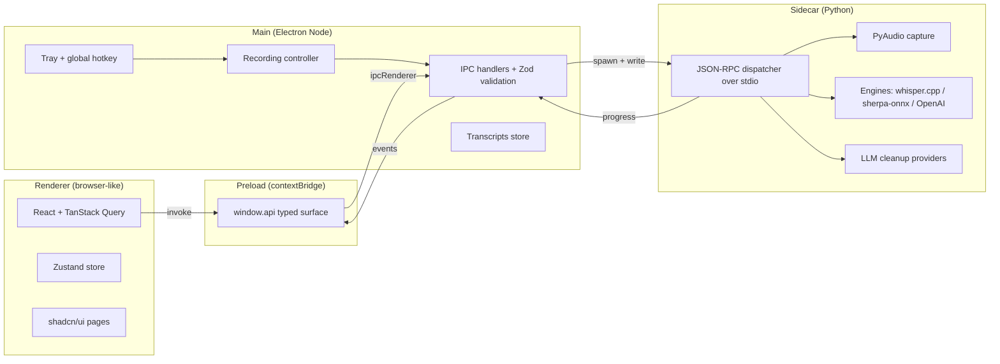

# Architecture

This document describes how the ultimateASR codebase is organised, how the
processes talk to each other, and where the load-bearing seams sit. It is
the companion to the
[implementation plan](./superpowers/plans/) and the test suite.

## High-level

ultimateASR is an Electron desktop app with a Python audio/inference
sidecar. There are four logical layers:



The renderer owns no privileged APIs. Every system capability — file I/O,
audio, model downloads, hotkeys, tray, clipboard — sits on the main side
or the sidecar. The renderer talks to main exclusively through the typed
`window.api` proxy that the preload script installs via `contextBridge`.

The main process owns the user-visible operating surface that exists when
no window is open: the system tray and the global hotkey. Both toggle the
recording state machine described below.

The sidecar owns everything that needs Python's ML ecosystem: whisper.cpp
through `pywhispercpp`, NVIDIA Parakeet through `sherpa-onnx`, the
OpenAI Whisper REST client, and the four LLM cleanup adapters. It has no
GUI; it speaks JSON-RPC over stdio.

## IPC contract

The IPC surface is defined once in TypeScript and validated on the way
in and the way out. The single source of truth is
[`src/shared/ipc-contract.ts`](../src/shared/ipc-contract.ts). It exports
a `ipcContract` constant whose leaves are `{ input, output }` Zod schemas.

```
src/shared/ipc-contract.ts   <-- schemas (Zod) shared by both sides
src/main/ipc.ts              <-- handle() with validation + dispatch
src/preload/index.ts         <-- contextBridge surface (window.api)
src/renderer/lib/ipc.ts      <-- typed RendererApi facade
```

At runtime:

1. The renderer calls `api.settings.set({ ... })`.
2. The preload forwards through `ipcRenderer.invoke("settings.set", ...)`.
3. Main parses the input against the input schema, runs the handler,
   parses the output against the output schema, and returns it.
4. Anything that fails validation throws — both directions.

The dotted channel names cover:

- `ping`
- `settings.get`, `settings.set`
- `hardware.detect`, `hardware.recommendBackend`, `hardware.recommendModel`
- `devices.list`
- `models.listAvailable`, `models.listDownloaded`, `models.download`,
  `models.delete`
- `recording.start`, `recording.stop`
- `transcribe`
- `llm.cleanup`
- `transcripts.list`, `transcripts.clear`

Push events go the other way over a small `events` channel:

- `progress` — sidecar download progress (`{ name, downloaded, total }`).
- `recording-state` — FSM transitions (see below).
- `transcript-added` — new transcript appended to the store.

## Sidecar JSON-RPC methods

The sidecar implements a simple JSON-RPC 2.0 dispatcher in
[`sidecar/ultimate_asr/dispatcher.py`](../sidecar/ultimate_asr/dispatcher.py).
Each request is one line of JSON on stdin; each response is one line on
stdout. Notifications (no `id`) are used for streaming progress.

| Method                  | Purpose                                                    |
| ----------------------- | ---------------------------------------------------------- |
| `ping`                  | Liveness probe; returns `"pong"`.                          |
| `hardware.detect`       | OS, arch, CPU count, RAM, CUDA / Metal / Vulkan / CoreML.  |
| `hardware.recommend_backend` | Pick the fastest available compute backend.           |
| `hardware.recommend_model`   | Pick a model that fits RAM and backend.               |
| `devices.list`          | Enumerate input audio devices via PyAudio.                 |
| `models.list_available` | Catalog of downloadable models.                            |
| `models.list_downloaded`| Files present under the data dir.                          |
| `models.download`       | Download a model; emits `progress` notifications.          |
| `models.delete`         | Remove a downloaded model.                                 |
| `recording.start`       | Begin PCM capture; returns a `session_id`.                 |
| `recording.stop`        | Finish capture; returns base64 PCM + sample rate.          |
| `transcribe`            | Run engine over PCM and return cleaned text.               |
| `llm.cleanup`           | Optional LLM rewrite of a transcript.                      |

`progress` notifications carry `{ method: "progress", params: { name, downloaded, total } }`
during downloads. The main process forwards them to the renderer over
`events` so the Models page can render a live progress bar.

### Escape hatches

Several environment variables exist to make tests fast and offline:

- `ULTIMATEASR_E2E_SIDECAR` — point at a Node script and the main process
  spawns *that* in place of the real sidecar. Used by Playwright specs to
  mock long-running RPC calls deterministically.
- `ULTIMATEASR_PYTHON` — override the interpreter used to launch the
  sidecar (default `python3`). Useful in CI where `python` is not on PATH.
- `ULTIMATEASR_TRANSCRIBE_STUB` — when set, the sidecar's `transcribe`
  handler short-circuits and returns the env var's value as the transcript.
  Used in unit and E2E tests to avoid loading any ASR model.
- `ULTIMATEASR_DATA_DIR` — override the sidecar's userData root. Tests
  point this at a temp dir so settings/transcripts/models don't pollute
  the user's real profile.

## Recording flow FSM

The recording controller lives in
[`src/main/recording-controller.ts`](../src/main/recording-controller.ts)
and is a finite state machine with six states:

```
                  toggle               vad/timeout
   idle --start-->  starting --ready--> recording --stop--> stopping
                                                              |
                                                              v
   idle <--persist-- cleaning <--llm-- transcribing <--pcm----+
```

- **idle** — nothing is happening; tray icon shows the rest state.
- **starting** — main has called `recording.start`; waiting for the
  sidecar to confirm capture has begun.
- **recording** — actively capturing; tray icon pulses.
- **stopping** — sidecar is finalising the PCM buffer.
- **transcribing** — sidecar is running the chosen engine over the PCM.
- **cleaning** — optional LLM cleanup pass.

Toggle is requested from two places:

- The **tray menu** ("Start dictation" / "Stop dictation"), built in
  [`src/main/tray.ts`](../src/main/tray.ts).
- The **global hotkey** registered in [`src/main/hotkey.ts`](../src/main/hotkey.ts).
  Default is `Ctrl+Alt+Shift+L`. On Wayland we also register an evdev
  fallback because the X11 grab may fail.

Every transition is broadcast over the `recording-state` event channel so
the renderer's status pill reflects truth without polling.

## Engine selection

The sidecar's engine factory is at
[`sidecar/ultimate_asr/engine/factory.py`](../sidecar/ultimate_asr/engine/factory.py).
It accepts an `engine_kind` string and returns a configured engine:

| `engine_kind`     | Resolves to                                              |
| ----------------- | -------------------------------------------------------- |
| `auto`            | Currently aliases `whisper-local`. Reserved for future.  |
| `whisper-local`   | `WhisperEngine` over `pywhispercpp` (whisper.cpp GGML).  |
| `parakeet-local`  | `ParakeetEngine` over `sherpa-onnx` Parakeet ONNX dir.   |
| `cloud-openai`    | `OpenAICloudEngine` over the OpenAI Whisper REST API.    |

The factory dispatches on file shape: a `.bin` path means whisper.cpp; a
directory containing `encoder-model*.onnx` means Parakeet.

## Vocabulary

Both local engines support a per-user custom vocabulary that the user
manages on the Dictionary page. The two engines bias differently:

- **Whisper** (`whisper-local`, `cloud-openai`) — vocabulary words are
  joined with commas and passed as the `initial_prompt` parameter. This
  steers the decoder toward those tokens without forcing them.
- **Parakeet** — sherpa-onnx does not expose prompt biasing, so we apply
  fuzzy substitution after transcription. Each output token is matched
  against the vocabulary using a Levenshtein threshold, and close matches
  are replaced. See `sidecar/ultimate_asr/engine/parakeet_engine.py`.

## Persistence

All user state is written to disk by the main process so the sidecar can
be restarted without losing anything.

| File                   | Purpose                                       |
| ---------------------- | --------------------------------------------- |
| `settings.json`        | Validated by `SettingsSchema`. Atomic writes. |
| `transcripts.json`     | Last 10 transcripts, FIFO eviction.           |

The location is the Electron `userData` directory, which is OS-specific:

| OS      | Path                                                  |
| ------- | ----------------------------------------------------- |
| macOS   | `~/Library/Application Support/ultimateASR`           |
| Windows | `%APPDATA%\ultimateASR`                               |
| Linux   | `$XDG_DATA_HOME/ultimateASR` (default `~/.config/ultimateASR`) |

Models are downloaded to `<userData>/models/` so they are scoped to the
same profile as the settings that reference them.

## Packaging

Production builds bake the sidecar into the installer so end users do not
need Python on their machine.

1. **Sidecar bundle.** `scripts/build-sidecar.mjs` runs PyInstaller and
   produces `dist-sidecar/<plat>-<arch>/ultimate_asr/`. The output is a
   directory containing the bundled interpreter, runtime, and all wheels
   needed by the chosen extras (whisper, parakeet, openai, …).
2. **Electron bundle.** `electron-builder` reads `electron-builder.yml`
   and copies that sidecar directory into the asar's
   `extraResources/sidecar` slot. The TypeScript code resolves the path
   at runtime via `process.resourcesPath`.
3. **Per-OS installers.** electron-builder produces an AppImage on Linux,
   a DMG on macOS, and an NSIS-based EXE on Windows.
4. **Release matrix.** `.github/workflows/release.yml` runs the above on
   `ubuntu-latest`, `macos-latest`, and `windows-latest` whenever a `v*`
   tag is pushed, then attaches the artifacts to a GitHub Release.
